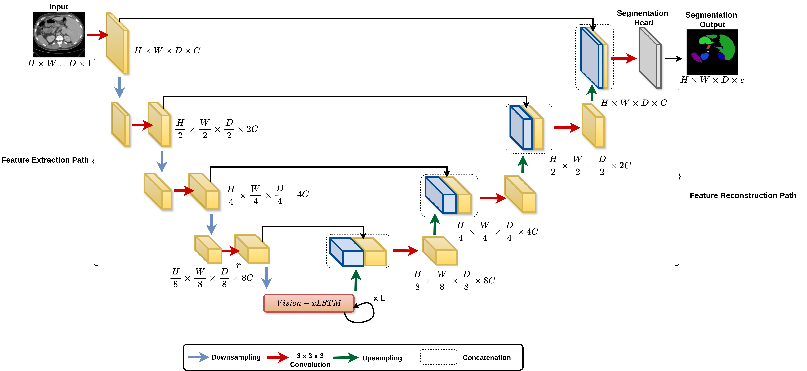

## [Are Vision-xLSTM-embedded U-Nets Better at Segmenting Medical Images ?](https://arxiv.org/abs/2406.16993)

:pushpin: This is an official PyTorch implementation of **Are Vision-xLSTM-embedded U-Nets Better at Segmenting Medical Images ?**

[[`Project Page`](https://u-vixlstm.github.io/)] [[`arXiv`](https://arxiv.org/abs/2406.16993)] [[`BibTeX`](#citation)]



> [**Are Vision-xLSTM-embedded U-Nets Better at Segmenting Medical Images ?**](https://arxiv.org/abs/2406.02918)<br>
> Pallabi Dutta\*, Soham Bose<sup>+</sup>, [Swalpa Kumar Roy](https://swalpa.github.io/)<sup>✉</sup>, and [Sushmita Mitra](https://www.isical.ac.in/~sushmita/)\*

**Abstract**: The development of efficient segmentation strategies for medical images has evolved from its initial dependence on Convolutional Neural Networks (CNNs) to the current investigation of hybrid models that combine CNNs with Vision Transformers (ViTs). There is an increasing focus on creating architectures that are both high-performing and computationally efficient, capable of being deployed on remote systems with limited resources. Although transformers can capture global dependencies in the input space, they face challenges from the corresponding high computational and storage expenses involved. This research investigates the integration of CNNs with Vision Extended Long Short-Term Memory (Vision-xLSTM)s  by introducing the novel U-VixLSTM. 

The Vision-xLSTM blocks capture the temporal and global relationships within the patches extracted from the CNN feature maps. The convolutional feature reconstruction path upsamples the output volume from the Vision-xLSTM blocks to produce the segmentation output. Our primary objective is to propose that Vision-xLSTM forms an appropriate backbone for medical image segmentation, offering excellent performance with reduced computational costs. The U-VixLSTM exhibits superior performance compared to the state-of-the-art networks in the publicly available Synapse, ISIC and ACDC datasets.

## 📚 Datasets

The BTCV dataset can be accessed from [https://doi.org/10.7303/syn3193805](https://doi.org/10.7303/syn3193805)

## 🛠 Setup
Installation of necessary Python packages using:
```
pip install requirements.txt

```
Structure of model directory:
```
model
   |----UVixLSTM.py
   |----VisionLSTM.py

```
## 📜Citation
If you like our work, please consider giving it a star ⭐ and cite us
```
@article{dutta2024segmentation,
	title={Are Vision xLSTM Embedded UNet More Reliable in Medical 3D Image Segmentation?},
	author={Dutta, Pallabi and Bose, Soham and Roy, Swalpa Kumar and Mitra, Sushmita},
	url={https://arxiv.org/abs/2406.16993}, 
  	journal={arXiv},
	pp.={1-9},
	year={2024}
	}
```

## 🎈 Acknowledgement

Part of this code is implementation from [https://github.com/nx-ai/vision-lstm]
